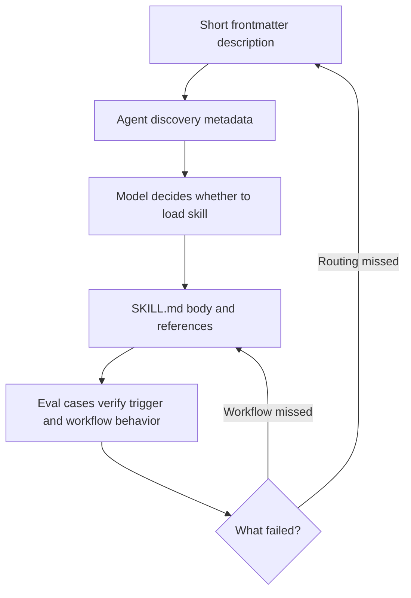

# Agent Skill Compatibility

Agent skills are portable only when their always-visible metadata is small,
specific, and compatible with several coding-agent discovery systems. This repo
therefore treats frontmatter `description` as an index entry, not as the place
for the full workflow.

## Platform Notes

| Agent surface | What is documented | Length guidance |
| --- | --- | --- |
| Codex | Codex exposes skill name, description, and file path in session skill metadata; this repo observed Codex omitting local skills whose descriptions were around 1.1-1.4 KB. | Keep descriptions well below 1 KB; use repo lint at 900 UTF-8 bytes. |
| Claude Code | Claude uses `description` to decide when to load a skill, recommends concise bodies, says `SKILL.md` should stay under 500 lines, and re-attaches only the first 5,000 tokens per skill after compaction within a 25,000-token combined budget. | No public description byte limit found; keep descriptions compact and bodies under 500 lines. Source: [Claude Code skills](https://docs.claude.com/en/docs/claude-code/skills). |
| GitHub Copilot | Copilot skills use name and description to decide relevance. Copilot recommends skills for detailed, relevant-on-demand instructions; custom instructions should stay short, and Copilot code review reads only the first 4,000 characters of custom instruction files. | No public skill-description byte limit found; use concise trigger summaries. Sources: [Adding agent skills](https://docs.github.com/en/copilot/how-tos/use-copilot-agents/coding-agent/create-skills), [custom instructions](https://docs.github.com/en/copilot/concepts/prompting/response-customization?tool=visualstudio). |
| Gemini CLI | Gemini CLI has `/skills` commands for discovered agent skills, extensions can bundle `skills/<name>/SKILL.md`, and adjacent custom command descriptions are documented as brief one-line descriptions. | Treat descriptions as one-line routing metadata. Sources: [Gemini commands](https://github.com/google-gemini/gemini-cli/blob/main/docs/reference/commands.md), [Gemini extensions](https://github.com/google-gemini/gemini-cli/blob/main/docs/extensions/reference.md), [Gemini custom commands](https://google-gemini.github.io/gemini-cli/docs/cli/custom-commands.html). |
| Cursor | Agent-requested rules require a description so the AI can decide whether to include the rule. Rules can also be attached by glob or always-on settings. | Keep descriptions specific enough for relevance routing; do not use them as full rules. Source: [Cursor rules](https://docs.cursor.com/context/rules). |

## Repo Policy

- Hard limit: skill frontmatter `description` must be at most 900 UTF-8 bytes.
- Preferred range: 300-700 UTF-8 bytes for normal skills.
- Description content: capability, primary trigger contexts, and one important
  boundary if needed.
- Body content: workflow steps, edge cases, exact phrase lists, platform
  variants, safety requirements, and output expectations.
- Eval content: positive triggers, negative triggers, ambiguous prompts, and
  workflow constraints that should remain true after the description is
  compressed.

## Eval Tuning Rule

Do not optimize skill eval pass rate by continuously adding edge cases, phrase
lists, or workflow details to frontmatter `description`. That creates a local
eval win and a cross-agent discovery loss: the always-visible metadata becomes
large enough to be truncated, omitted, or ignored by some harnesses.

When an eval fails, classify the failure first:

- **Routing failure**: the agent did not select the skill for an intended prompt,
  or selected it for a negative prompt. Adjust the description only if the
  missing trigger is a broad primary context, then add or update routing evals.
- **Workflow failure**: the agent selected the skill but missed a step, boundary,
  output shape, safety rule, or platform variant. Update the `SKILL.md` body,
  a reference file, or the eval expectation. Do not put the missing workflow
  detail into the description.
- **Ambiguous prompt failure**: the prompt can reasonably map to multiple skills
  or no skill. Prefer negative/ambiguous eval coverage and clearer boundaries
  over longer descriptions.

Use the description as a table-of-contents entry. Use evals to preserve behavior
after compression, not as pressure to keep expanding the index.

This policy is intentionally stricter than most public docs because agent
discovery metadata is loaded before the skill body and may be truncated,
budgeted, or omitted differently across harnesses.

*Last updated: 2026-05-21 | Reason: Added eval-tuning guidance to prevent description bloat.*
