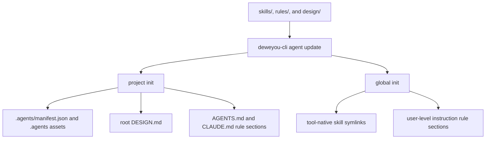

# Asset Workflow

This document defines how to create, install, and maintain assets in this
repository.



*Last updated: 2026-05-21 | Reason: Clarified neutral skill wording and CI follow-up semantics.*

## Repository Conventions

These rules apply to every agent asset in this repo:

1. **Save location**: Skills live under `skills/`, for example
   `skills/my-feature/SKILL.md`. Rules live under `rules/`, for example
   `rules/code-style.md`. Design contracts live under `design/`, for example
   `design/dewey-interface.md`.
2. **Naming**: Directory names, rule filenames, and frontmatter `name` values are
   kebab-case. Design filenames also use kebab-case. Good: `data-export`. Bad:
   `DataExport`, `data_export`.
3. **Implementation language**: Implement skills, rules, MCP assets, and plugin
   assets in English. Keep frontmatter, instructions, examples, prompts, script
   help text, and user-facing runtime messages in English unless an asset exists
   specifically to translate or process non-English content.
4. **Neutral skill wording**: Files under `skills/` should avoid personal-name
   or owner-name wording in descriptions, instructions, references, READMEs, and
   eval cases. Prefer neutral phrases such as `the user`, `the owner`, `personal
   style`, `the active product`, or `the current component library`. Keep real
   package names only when they are required executable identifiers.
5. **Skill eval coverage**: Every new or modified skill must include an updated
   eval suite at `skills/<name>/evals/evals.json`. Use the `skill-eval` workflow
   to generate or complete cases that cover positive triggers, negative triggers,
   and workflow constraints. Running the eval suite is still a separate,
   explicit user decision because it invokes LLMs.
6. **Validation**: Run `pnpm run lint:assets` after changing skills, rules, or
   design contracts. Run `pnpm test` after changing asset-scanning behavior.

## Asset Types

- **Skills** are active workflows. They live in `skills/<name>/SKILL.md`.
- **Rules** are passive reusable constraints. They live in `rules/<name>.md`.
- **Design contracts** are project-level UI/visual source-of-truth files. In
  this asset hub they live under `design/<name>.md`; when installed into a
  product repository, the selected design contract is written as root
  `DESIGN.md`.
- **Runtime CLI code** lives in `cli/` as a TypeScript npm package.

Skills, rules, MCP assets, and plugin assets should be authored in English. This
keeps reusable agent instructions portable across harnesses and avoids mixing
repository policy with one user's local language preference.

Do not rename rule files to `*.rules.md`; this repository keeps rule filenames
plain for registry and CLI consumption.

Public README descriptions should explain what each skill or rule does. Avoid
leading with ownership language such as a person's name when the functionality
can be described directly.

For skills specifically, also check `README.md`, `SKILL.md`, `evals/`, and
`references/` before handoff:

```bash
rg -i "personal-name-or-brand-pattern" skills
```

## Generated Registry

The source repository does not commit `registry.json`. `deweyou-cli agent update`
clones or pulls `https://github.com/deweyou/agents.git` into
`~/.deweyou/agents/source` by default, scans `skills/`, `rules/`, and `design/`,
generates a registry with paths, descriptions, optional frontmatter tags, and
`sha256:` content hashes, then writes that registry into the local cache at
`~/.deweyou/agents/assets/registry.json`.

Set `DEWEYOU_AGENTS_SOURCE=/path/to/deweyou/agents` only when you want to scan a
specific local checkout instead of the default cached source.

Run:

```bash
pnpm run lint:assets
```

after asset changes so frontmatter and naming stay valid before the CLI scans
them.

## Installation Semantics

`deweyou-cli agent init` supports project and global scopes.

Project installs write selected assets into `.agents/` according to the selected
mode and wire repository instruction files:

- Skills are installed under `.agents/skills/<skill>/`.
- Rules are installed under `.agents/rules/<rule>.md`.
- A selected design contract is installed as root `DESIGN.md`.
- `AGENTS.md` and `CLAUDE.md` receive managed rule sections when rules are
  selected.

Global installs keep instruction files lean:

- Skills are symlinked into tool-native directories such as
  `~/.codex/skills/<skill>` and `~/.claude/skills/<skill>`.
- Rules are written into user-level instruction files such as
  `~/.codex/AGENTS.md` and `~/.claude/CLAUDE.md`.
- Rule `reference` wiring writes the rule name, description, and path. Agents
  should read the rule body only when the description is relevant to the task.
- Rule `inline` wiring writes full rule bodies and should be reserved for
  environments that cannot follow file references.

## Creating Or Updating Design Contracts

Design contracts are broader than component examples and more structured than
ordinary rules. Use them for project-level UI/visual source-of-truth documents
that agents can install into product repositories as `DESIGN.md`.

Each design contract is a Markdown file with YAML frontmatter:

```yaml
---
name: dewey-interface
description: Short description of the design contract.
---
```

The frontmatter `name` must match the filename without `.md`. Keep the body in
English and include the design thesis, tokens or token guidance, principles,
component/interaction guidance, accessibility expectations, and do/don't rules.

After changing design contracts:

```bash
pnpm run lint:assets
```

Update the root README design section when the public design contract list or
description changes. If `README_ZH.md` has matching prose, update it in the same
change.

## Creating A New Skill

### 1. Capture Intent

Ask the user:

- What should this skill enable the agent to do?
- When should it trigger? Include example user phrases.
- What should the output look like?
- Does it need test cases to verify correctness, or is the output subjective?

Derive a kebab-case name from the user's intent and confirm it before proceeding.

### 2. Draft `SKILL.md`

Write the draft at `skills/<kebab-name>/SKILL.md`. The frontmatter must include:

```yaml
---
name: <kebab-name>
description: >
  <What it does and when to trigger. Be specific enough that agents use it.>
---
```

Then write the skill body: instructions, examples, output format, and edge cases.

### 3. Test And Iterate

Use `skill-eval` to create the first eval suite:

- Write realistic prompts to `skills/<kebab-name>/evals/evals.json`.
- Cover positive triggers, negative triggers, workflow constraints, and ambiguous
  prompts when ambiguity matters.
- Use objectively gradable `expectations[]` entries.
- Do not run the eval suite unless the user explicitly asks to spend LLM tokens.

### 4. Finalize

Ensure the directory is `skills/<kebab-name>/` and the frontmatter name matches
the directory.

### 5. Create Skill README

Every skill directory gets a `README.md` alongside `SKILL.md`:

```markdown
# <skill-name>

> <One-sentence description of what the skill enables agents to do.>

## What it does

<2-4 sentences describing the skill's capabilities, trigger context, and output.>

## When it triggers

<List the user phrases or contexts that cause agents to invoke this skill.>

## Installation

\`\`\`bash
npx skills add https://github.com/deweyou/agents --skill <kebab-name>
\`\`\`

## Source

This skill is maintained in `deweyou/agents` and indexed by `deweyou-cli agent update`.
```

### 6. Update Root README

Add or update the skill row in the root README skills table.
When a public description changes in `README.md`, check whether the matching
entry exists in `README_ZH.md` and update it in the same change.

## Updating An Existing Skill

1. Read the current `skills/<name>/SKILL.md` in full.
2. Clarify what should change: bug fix, new feature, or behavior change.
3. Snapshot the current skill before editing:

   ```bash
   cp -r skills/<name> /tmp/<name>-snapshot/
   ```

4. Apply only the necessary edits.
5. Use `skill-eval` to update or create `skills/<name>/evals/evals.json` so the
   changed trigger or workflow behavior is covered.
6. Test with prompts that cover the changed behavior. Run the eval suite only
   when the user explicitly requests execution.
7. Run `pnpm run lint:assets` so frontmatter and naming stay valid.
8. Update the root README skills table when the public description changes.
   If `README_ZH.md` has a matching entry, update it in the same change.

## Creating Or Updating Rules

Rules are broader and steadier than skills. Use rules for preferences or constraints
that should apply across projects.

Each rule is a Markdown file with YAML frontmatter:

```yaml
---
name: code-style
description: Short description of what the rule governs.
---
```

Rule names must match filenames without `.md`. Keep rule language direct and
actionable. The description is used in `reference` wiring so agents can decide
whether to read the rule body; write it as a concrete one-sentence applicability
summary. If a rule becomes a task-specific step-by-step workflow, promote it to a
skill.

Rules must be authored in English, following the same language policy as skills.

After changing rules:

```bash
pnpm run lint:assets
```

Run `pnpm run lint:assets` after rule changes. Update the root README rules
table when the public description changes.

## CLI Release Workflow

CLI release, changelog, and npm publishing live under `cli/`. The root
`@deweyou/agents` package stays private and only hosts assets plus workflows.

The published npm package is `deweyou-cli`, and the installed binary is also
`deweyou-cli`.

### Local Verification

After changing CLI behavior, release logic, or CLI tests, run:

```bash
npm run typecheck:cli
npm run test:cli
npm run coverage:cli
cd cli && npm pack --dry-run
```

Use `npm pack --dry-run` to confirm the npm tarball only contains CLI package
files such as `dist/`, `README.md`, `CHANGELOG.md`, and `package.json`. Skills
and rules are source assets and must not be bundled into the CLI package.

### GitHub Release Flow

Merging CLI package changes into `main` triggers
[`.github/workflows/cli-release.yml`](../.github/workflows/cli-release.yml).
The workflow:

1. Installs dependencies in `cli/`.
2. Runs typecheck, tests, coverage, and `npm pack --dry-run`.
3. Reads changed CLI files and commit subjects for the merge range.
4. Runs `cli/scripts/prepare-release.ts`.
5. If a release is needed, commits `cli/package.json` and
   `cli/CHANGELOG.md`, creates a `cli-vX.Y.Z` tag, publishes
   `deweyou-cli`, then pushes the release commit and tag.

The workflow requires `NPM_TOKEN` in GitHub Actions secrets. It skips release
commits whose message starts with `chore(release):` to avoid publish loops.

### Version Rules

Release versioning is inferred from conventional commit subjects in the CLI
change range:

- `feat:` creates a minor release.
- `fix:`, `perf:`, and `refactor:` create a patch release.
- `!` or `BREAKING CHANGE` creates a major release.
- `docs:` may appear in changelog output, but does not publish by itself.
- `test:` and `chore:` do not publish by themselves.

If CLI files changed but no releasable commit subject is present, the workflow
marks `released=false` and does not commit, tag, or publish.

### Changelog Rules

`prepare-release.ts` prepends `cli/CHANGELOG.md` with grouped release notes:

- `Breaking Changes`
- `Added`
- `Fixed`
- `Improved`
- `Changed`
- `Dependencies`
- `Documentation`

Scopes are preserved in changelog items. For example,
`fix(cache): refresh generated registry` becomes:

```markdown
### Fixed

- cache: refresh generated registry
```

Keep CLI-facing commit subjects user-readable. Prefer
`feat(init): add interactive asset picker` over vague subjects like
`feat: update stuff`.
