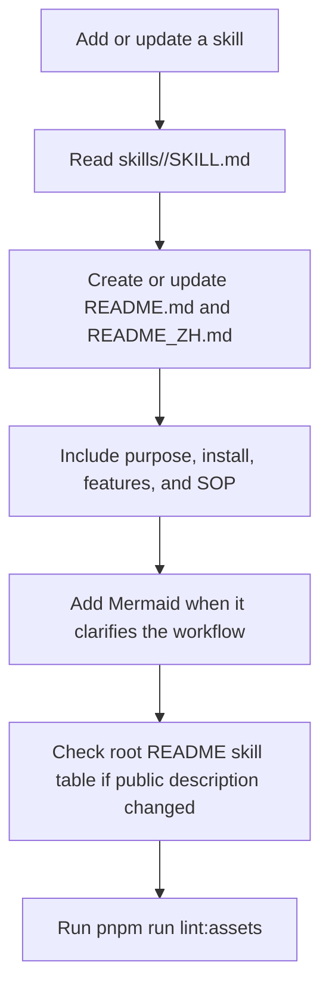
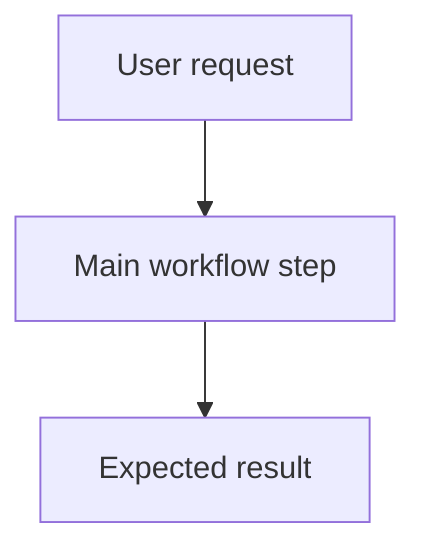
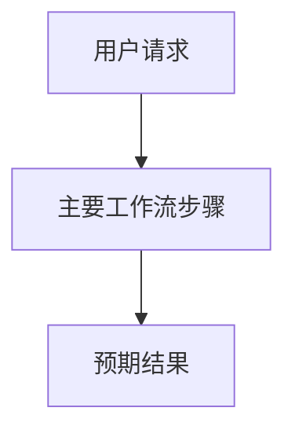

# Skill READMEs



Every skill directory owns public `README.md` and `README_ZH.md` files beside
`SKILL.md`. These READMEs are the human-facing summaries of the workflow, while
`SKILL.md` remains the executable agent instruction.

## Required Sections

- `README.md` uses English headings. `README_ZH.md` uses Chinese headings while
  keeping executable identifiers, commands, and the `Source` section stable.
- `What it does` / `它是做什么的` gives a short practical summary of the skill's
  purpose and trigger context.
- `Installation` / `安装` includes the direct Skills CLI command:
  `npx skills add deweyou/agents --skill <name>`.
- `Features` / `特点` lists the skill's notable behaviors, boundaries, and guarantees.
- `SOP` lists the normal operating procedure an agent or maintainer should
  expect.
- `Source` states that the skill is maintained in `deweyou/agents` and indexed
  by `deweyou-cli agent update`.

## Maintenance Rules

- Add `skills/<name>/README.md` and `skills/<name>/README_ZH.md` whenever adding
  a new skill.
- Update both READMEs whenever `skills/<name>/SKILL.md` changes in a way that
  affects triggers, workflow, dependencies, side effects, output, or
  installation.
- Keep README wording neutral and portable. Avoid personal-name or owner-name
  phrasing unless it is an executable package or repository identifier.
- Prefer a Mermaid diagram for multi-step skills, especially when the workflow
  has gates, branches, or handoffs.
- Keep the README concise enough to scan; detailed agent-only instructions belong
  in `SKILL.md` or `references/`.
- If the public skill description changes, update the root `README.md` skill row
  and the matching `README_ZH.md` entry.
- Skill behavior changes still require updated eval coverage in
  `skills/<name>/evals/evals.json`; README-only edits do not require eval changes.

## Template

### English

````markdown
# <skill-name>

> <One-sentence description of what the skill enables agents to do.>

## What it does

<2-4 sentences describing the capability, trigger context, and output.>



## Installation

```bash
npx skills add deweyou/agents --skill <skill-name>
```

For repository-wide setup, prefer:

```bash
deweyou-cli agent init --skills <skill-name>
```

## Features

- <Feature or guarantee>
- <Boundary or safety rule>

## SOP

1. <First operating step>
2. <Second operating step>
3. <Verification or handoff step>

## Source

This skill is maintained in `deweyou/agents` and indexed by
`deweyou-cli agent update`.
````

### Chinese

````markdown
# <skill-name>

> <一句话说明这个 skill 帮 agent 做什么。>

## 它是做什么的

<2-4 句话说明能力、触发场景和输出。>



## 安装

```bash
npx skills add deweyou/agents --skill <skill-name>
```

仓库级接入更推荐：

```bash
deweyou-cli agent init --skills <skill-name>
```

## 特点

- <特点或保证>
- <边界或安全规则>

## SOP

1. <第一步>
2. <第二步>
3. <验证或交付步骤>

## Source

This skill is maintained in `deweyou/agents` and indexed by
`deweyou-cli agent update`.
````

---
*Last updated: 2026-05-21 | Reason: Added bilingual skill README requirements*
