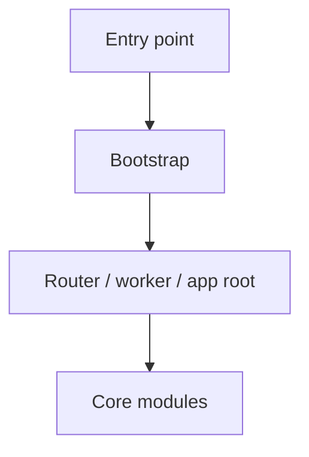
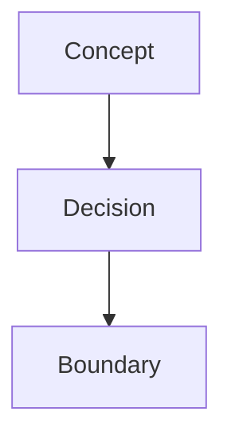

# Templates

## AGENTS.md - Standard Repo

```markdown
# <Project Name>

<1-2 sentences: what this codebase does and who uses it>

## Knowledge Base

| Document | What it covers |
|----------|----------------|
| [docs/project-structure.md](docs/project-structure.md) | Top-level structure and how the app boots |
| [docs/<topic>.md](docs/<topic>.md) | <description> |

## Hard Constraints

- <constraint>
- <constraint>

## Task Routing

- If you're modifying <domain X>, read [docs/<topic>.md](docs/<topic>.md) first.
- If you're touching <risky area>, check [docs/<topic>.md](docs/<topic>.md).
```

## AGENTS.md - Monorepo Root

```markdown
# <Monorepo Name>

<1-2 sentences: what the monorepo contains and how packages relate>

## Packages

| Package | AGENTS.md | What it does |
|---------|-----------|--------------|
| `packages/api` | [->](packages/api/AGENTS.md) | <description> |
| `packages/web` | [->](packages/web/AGENTS.md) | <description> |

## Cross-Package Knowledge

| Document | What it covers |
|----------|----------------|
| [docs/project-structure.md](docs/project-structure.md) | Root layout and app startup map |
| [docs/<topic>.md](docs/<topic>.md) | Shared contracts or cross-package rules |

## Hard Constraints

- <cross-package constraint>

## Task Routing

- If you're changing a shared type, read [docs/<topic>.md](docs/<topic>.md) first.
- If you're unsure which package owns X, check the Packages table, then that package's AGENTS.md.
```

## project-structure.md

````markdown
# Project Structure

<1 sentence: what this repo is and how it is organized>

## Startup Path



## Directory Layout

```text
src/                    application code
src/<module>/           domain area
scripts/                developer tooling
docs/                   repository knowledge base
```

## Conventions

- <where business logic lives>
- <where to add new code>

## Key Files

- [src/main.ts#L1](../src/main.ts#L1) - entry point

---
*Last updated: YYYY-MM-DD | Reason: initial knowledge base setup*
````

## Knowledge Doc

````markdown
# <Question this document answers>



<1-2 sentences of context>

## Key Rules

- <rule or invariant>
- <pitfall>

## Key Files

- [src/<path>.ts#L1](../src/<path>.ts#L1) - <why it matters>

## Open Questions

- TODO: <unknown that needs confirmation>

---
*Last updated: YYYY-MM-DD | Reason: <why this was written or updated>*
````

## .state.md

```markdown
# Knowledge State

- Last reviewed commit: `<sha>`
- Iteration: `1`
- Last mode: `init`
- Covered areas: `<area>`, `<area>`
- Open risks: `<risk>`
```

## .todo.md

```markdown
# Knowledge TODO

- [ ] Trace refund lifecycle from API request to settlement job
- [ ] Confirm ownership boundary between billing and order state transitions
```
