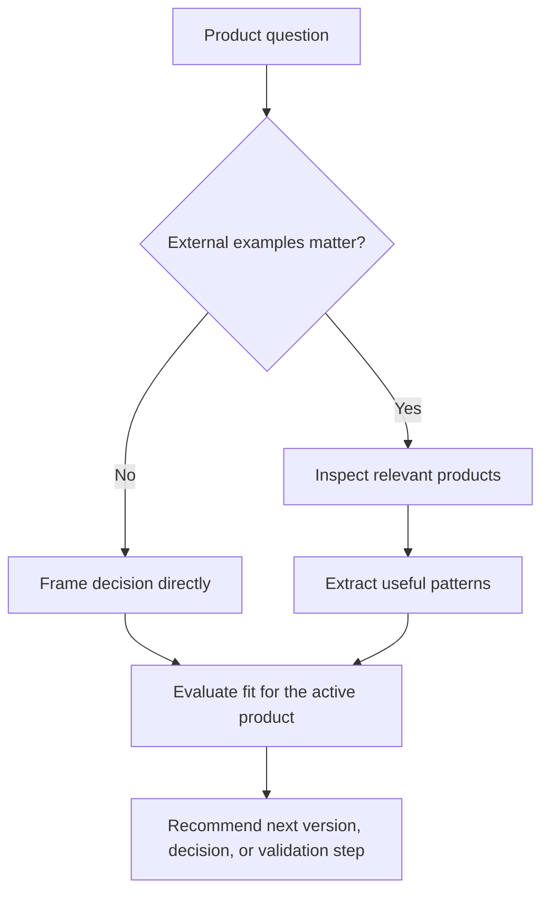

# product-design

> Product-design partner for shaping personal-product ideas into right-sized,
> buildable decisions.

## What it does

`product-design` helps decide whether an idea or feature is worth doing, how the
next version should be shaped, and what similar products suggest. It keeps the
work practical for personal products: enough research and structure to make a
good decision, without defaulting to enterprise PRD theater.



## Installation

```bash
npx skills add deweyou/agents --skill product-design
```

For repository-wide setup, prefer:

```bash
deweyou-cli agent init --skills product-design
```

## Features

- Separates observation, judgment, assumptions, validation needs, and
  recommendations.
- Uses product research when current external examples can change the answer.
- Compares ideas against audience, scope, complexity, implementation cost, taste,
  and validation value.
- Recommends small buildable moves instead of broad roadmaps by default.
- Hands off to `product-notes` when the conclusion should become durable product
  memory.

## SOP

1. Restate the product question in one sentence.
2. Decide whether external references are needed.
3. If needed, inspect a proportional set of relevant products, docs, screenshots,
   pricing, onboarding, or credible reviews.
4. Extract patterns and useful differences instead of listing everything found.
5. Evaluate what fits the personal product and what should not be copied.
6. Recommend the next product direction, version shape, validation step, or
   decision to postpone.
7. Capture open questions only when they affect the next decision.

## Source

This skill is maintained in `deweyou/agents` and indexed by
`deweyou-cli agent update`.
