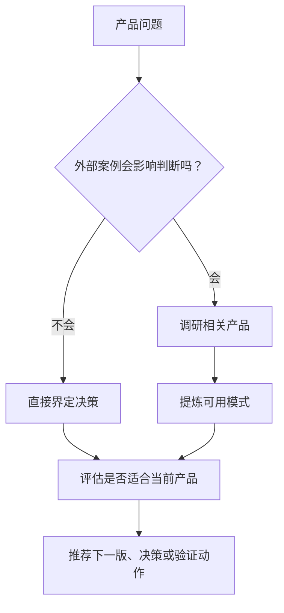

# product-design

> 面向个人产品的产品设计搭档，把想法沉淀为合适大小、可落地的产品决策。

## 它是做什么的

`product-design` 帮助判断一个想法或功能是否值得做、下一版应该怎么收敛，以及类似产品能提供什么启发。它会让个人产品获得足够的调研和结构，但不默认进入企业式 PRD 流程。



## 安装

```bash
npx skills add deweyou/agents --skill product-design
```

仓库级接入更推荐：

```bash
deweyou-cli agent init --skills product-design
```

## 特点

- 区分观察、判断、假设、验证需求和推荐。
- 当外部产品案例会改变答案时，先调研再建议。
- 从用户、范围、复杂度、实现成本、产品品味和验证价值评估想法。
- 默认推荐小而可构建的动作，而不是宽泛路线图。
- 当结论需要变成长期产品记忆时，交给 `product-notes` 沉淀。

## SOP

1. 用一句话重述产品问题。
2. 判断是否需要外部参考。
3. 如需调研，按问题大小检查相关产品、文档、截图、价格、onboarding 或可信评论。
4. 提炼模式和差异，而不是罗列所有发现。
5. 判断哪些适合当前个人产品，哪些不应复制。
6. 推荐下一步产品方向、版本形态、验证动作，或应该暂缓的决策。
7. 只记录会影响下一步决策的开放问题。

## Source

This skill is maintained in `deweyou/agents` and indexed by
`deweyou-cli agent update`.
