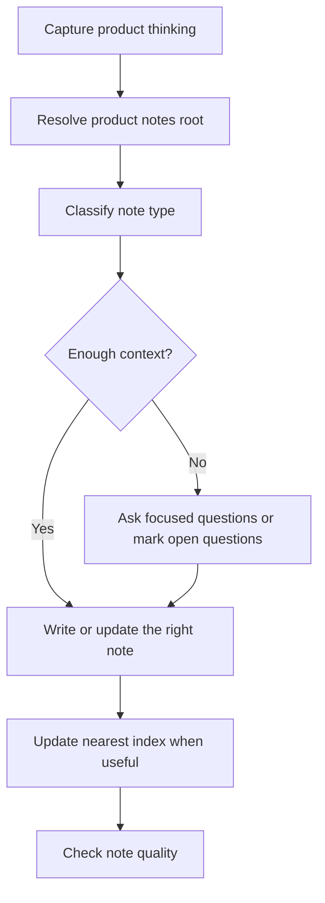

# product-notes

> Turn product ideas, positioning, iterations, decisions, insights, and reviews
> into durable product notes.

## What it does

`product-notes` maintains a living product note system. It resolves the product
notes root, classifies the input before writing, preserves why product direction
changed, and updates the right note type instead of flattening everything into a
generic PRD.



## Installation

```bash
npx skills add deweyou/agents --skill product-notes
```

For repository-wide setup, prefer:

```bash
deweyou-cli agent init --skills product-notes
```

## Features

- Resolves custom product-note roots from user input, repository conventions, or
  existing workspace structure.
- Persists location conventions in readable files when the user wants the
  location remembered.
- Classifies notes as positioning, iteration specs, decision records, insight
  notes, process notes, or reviews.
- Preserves facts, judgments, assumptions, status, and supersession history.
- Updates navigation only where it helps future readers.
- Respects existing workspace language, filenames, and Obsidian-style links.

## SOP

1. Resolve and state the product notes root.
2. Inspect existing structure, index files, positioning docs, iteration folders,
   decisions, insights, process notes, and archive conventions.
3. Classify the input into one or more note types.
4. Check whether the note has enough substance; ask up to three focused
   questions when needed.
5. Write or update the smallest useful note while separating facts, judgments,
   and assumptions.
6. Mark superseded or historical notes instead of deleting context.
7. Update the nearest useful index.
8. Report whether the note is ready to guide future work and what is still
   missing.

## Source

This skill is maintained in `deweyou/agents` and indexed by
`deweyou-cli agent update`.
