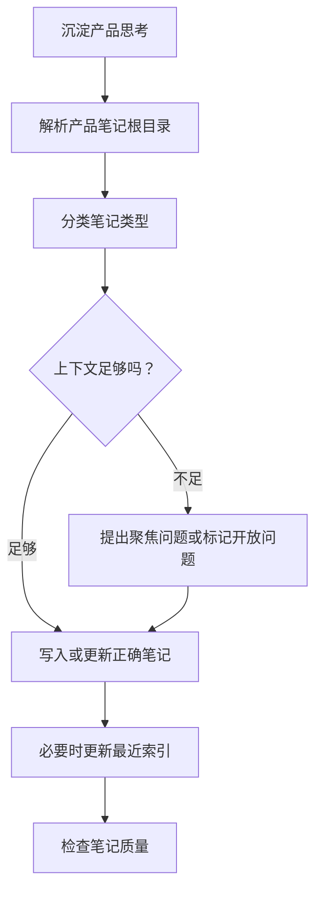

# product-notes

> 将产品想法、定位、迭代、决策、洞察和复盘写成可延续的产品笔记。

## 它是做什么的

`product-notes` 维护一个持续演进的产品笔记系统。它会先解析产品笔记根目录，再给输入分类，保留产品方向变化背后的原因，并更新正确类型的文档，而不是把所有内容都塞进通用 PRD。



## 安装

```bash
npx skills add deweyou/agents --skill product-notes
```

仓库级接入更推荐：

```bash
deweyou-cli agent init --skills product-notes
```

## 特点

- 从用户输入、仓库约定或现有工作区结构中解析自定义产品笔记根目录。
- 当用户希望“记住”位置时，把目录约定写入可读文件。
- 将内容分类为定位、迭代规格、决策记录、洞察笔记、过程笔记或复盘。
- 保留事实、判断、假设、状态和 supersession 历史。
- 只在有助于未来阅读时更新导航。
- 尊重现有工作区语言、文件命名和 Obsidian 风格链接。

## SOP

1. 解析并说明产品笔记根目录。
2. 检查现有结构、索引、定位文档、迭代目录、决策、洞察、过程笔记和归档约定。
3. 将输入分类为一种或多种笔记类型。
4. 判断信息是否足够；必要时最多问三个聚焦问题。
5. 写入或更新最小但有用的笔记，并区分事实、判断和假设。
6. 对过时或历史笔记做 superseded 标记，而不是删除上下文。
7. 更新最近且有用的索引。
8. 说明这份笔记是否足以指导未来工作，以及还缺什么。

## Source

This skill is maintained in `deweyou/agents` and indexed by
`deweyou-cli agent update`.
