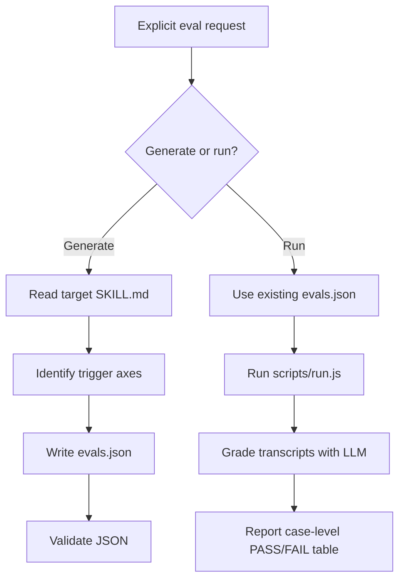

# skill-eval

> Evaluation workflow for generating skill eval cases, running agent CLI tests,
> grading transcripts, and summarizing routing accuracy.

## What it does

`skill-eval` maintains confidence that repository skills trigger at the right
time and follow their required workflow. It can generate
`skills/<name>/evals/evals.json` from a target `SKILL.md`, or run an existing
eval suite through an agent CLI and LLM grader.

Running evals invokes LLMs. Updating eval case files is part of normal skill
maintenance, but executing the eval runner requires an explicit user request.



## Installation

```bash
npx skills add deweyou/agents --skill skill-eval
```

For repository-wide setup, prefer:

```bash
deweyou-cli agent init --skills skill-eval
```

## Features

- Generates realistic eval cases from a skill's trigger boundaries and workflow
  constraints.
- Covers positive prompts, negative prompts, workflow constraints, and ambiguous
  prompts for non-trivial skills.
- Runs evals through `scripts/run.js` with configurable agent and grader command
  templates.
- Defaults recommendation to routing mode for trigger checks, avoiding real task
  side effects.
- Produces case-level PASS/FAIL summaries with failure reasons.
- Keeps run artifacts in temporary directories by default and prevents committed
  transcripts under `<skill>/evals/runs/`.
- Supports Codex, Claude, auto-detected presets, and custom command templates
  that include `{PROMPT_FILE}`.

## SOP

1. Confirm the user explicitly asked for eval generation or execution.
2. For generation, read the target `SKILL.md` and identify trigger boundaries,
   nearby non-triggers, required clarifications, side-effect limits, scripts, and
   output rules.
3. Write realistic cases to `skills/<name>/evals/evals.json`.
4. Validate the JSON structure.
5. For execution, use the existing eval file first; generate it only when it is
   missing and the user agrees to that step.
6. Prefer routing mode for skill trigger accuracy checks.
7. Tell the user once that execution invokes LLMs and may cost money.
8. Run `node skills/skill-eval/scripts/run.js --skill <name> --mode routing`.
9. Report a case-level PASS/FAIL table, failure categories, timeout retries, and
   whether artifacts were retained or deleted.

## Eval File Format

```json
{
  "skill_name": "<skill-name>",
  "evals": [
    {
      "id": 1,
      "prompt": "<realistic user wording>",
      "expected_output": "<plain-language summary of the expected result>",
      "expectations": [
        "Triggered the <skill-name> skill",
        "Did NOT trigger <other-skill>",
        "Asked the user to clarify X before doing Y"
      ]
    }
  ]
}
```

## Common Commands

Generate or update the eval file by following the SOP above, then validate it:

```bash
node -e "JSON.parse(require('fs').readFileSync('skills/<skill-name>/evals/evals.json', 'utf8'))"
```

Run routing evals:

```bash
node skills/skill-eval/scripts/run.js \
  --skill <skill-name> \
  --mode routing
```

Run one case:

```bash
node skills/skill-eval/scripts/run.js \
  --skill <skill-name> \
  --mode routing \
  --case 3
```

Keep temporary artifacts outside the repository:

```bash
node skills/skill-eval/scripts/run.js \
  --skill <skill-name> \
  --mode routing \
  --keep-runs
```

## Source

This skill is maintained in `deweyou/agents` and indexed by
`deweyou-cli agent update`.
