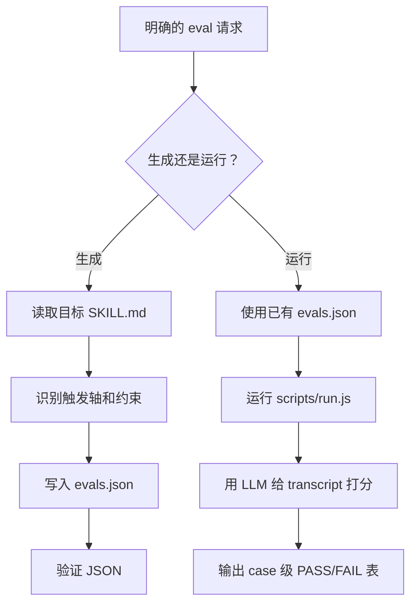

# skill-eval

> 用于生成 skill eval cases、运行 agent CLI 测试、给 transcript 打分并汇总路由准确率的评测工作流。

## 它是做什么的

`skill-eval` 用来维护对仓库 skills 的信心：它们是否在正确时机触发，并遵循要求的工作流。它可以根据目标 `SKILL.md` 生成 `skills/<name>/evals/evals.json`，也可以通过 agent CLI 和 LLM grader 运行已有 eval suite。

执行 eval 会调用 LLM。更新 eval case 文件是常规 skill 维护的一部分，但运行 eval runner 需要用户明确要求。



## 安装

```bash
npx skills add deweyou/agents --skill skill-eval
```

仓库级接入更推荐：

```bash
deweyou-cli agent init --skills skill-eval
```

## 特点

- 从 skill 的触发边界和工作流约束生成真实感 eval cases。
- 对非简单 skill 覆盖 positive prompts、negative prompts、workflow constraints 和 ambiguous prompts。
- 通过 `scripts/run.js` 运行 eval，并支持配置 agent 与 grader 命令模板。
- 推荐默认使用 routing mode 检查触发准确性，避免真实任务副作用。
- 输出 case 级 PASS/FAIL 汇总和失败原因。
- 默认将运行产物放在临时目录，并避免把 transcript 提交到 `<skill>/evals/runs/`。
- 支持 Codex、Claude、自动检测 preset，以及包含 `{PROMPT_FILE}` 的自定义命令模板。

## SOP

1. 确认用户明确要求生成或执行 eval。
2. 生成时，阅读目标 `SKILL.md`，识别触发边界、相近非触发场景、必要澄清、副作用限制、脚本和输出规则。
3. 将真实感 cases 写入 `skills/<name>/evals/evals.json`。
4. 验证 JSON 结构。
5. 执行时，优先使用已有 eval 文件；如果缺失，先生成，必要时征得用户同意。
6. skill 触发准确性检查优先使用 routing mode。
7. 执行前提醒一次：运行会调用 LLM，可能产生费用。
8. 运行 `node skills/skill-eval/scripts/run.js --skill <name> --mode routing`。
9. 汇报 case 级 PASS/FAIL 表、失败分类、timeout retry，以及产物是否保留或删除。

## Eval 文件格式

```json
{
  "skill_name": "<skill-name>",
  "evals": [
    {
      "id": 1,
      "prompt": "<realistic user wording>",
      "expected_output": "<plain-language summary of the expected result>",
      "expectations": [
        "Triggered the <skill-name> skill",
        "Did NOT trigger <other-skill>",
        "Asked the user to clarify X before doing Y"
      ]
    }
  ]
}
```

## 常用命令

生成或更新 eval 文件后，验证 JSON：

```bash
node -e "JSON.parse(require('fs').readFileSync('skills/<skill-name>/evals/evals.json', 'utf8'))"
```

运行 routing eval：

```bash
node skills/skill-eval/scripts/run.js \
  --skill <skill-name> \
  --mode routing
```

运行单个 case：

```bash
node skills/skill-eval/scripts/run.js \
  --skill <skill-name> \
  --mode routing \
  --case 3
```

将临时产物保留在仓库外：

```bash
node skills/skill-eval/scripts/run.js \
  --skill <skill-name> \
  --mode routing \
  --keep-runs
```

## Source

This skill is maintained in `deweyou/agents` and indexed by
`deweyou-cli agent update`.
